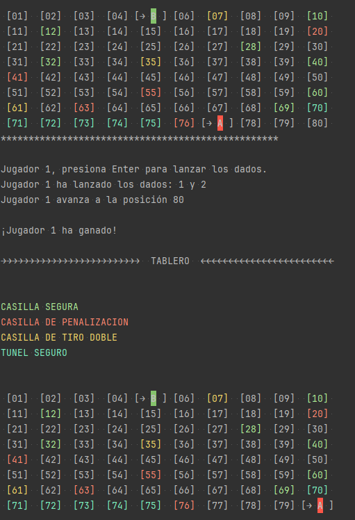

# Juego de Mesa

¡Bienvenido al Juego de Mesa! Este juego fue creado por un equipo de tres personas y promete horas de diversión para toda la familia.

## Cómo Jugar

Reglas:
- Cada jugador tiene como mínimo una ficha. El juego dispone de casillas seguras, de penalizacion, de tiro doble y un tunel de seguridad de 5 casillas antes del final.
- Los jugadores inician su recorrido si al lanzar el dado, se obtiene par.
- Si un jugador alcanza a otro en la misma casilla, el jugador alcanzado es penalizado.
- Si un jugador obtiene par, ha de tener derecho a otro lanzamiento. Si se alcanza 3 veces el lanzamiento par, ha de volver al inicio.
- Para ganar, todos los jugadores deben llevar sus fichas a la ultima casilla.
- Si un jugador come la ficha a otro, el jugador que come avanza 10 casillas.
- Si supera el límite de casillas en la meta, no avanza esas 10 casillas.

Total de casillas: 80 
- Casillas seguras: 10 - 12 - 28 - 32 - 40 - 60 - 69
- Casillas de penalizacion: 20 - 41 - 55 - 63 - 76
- Casillas de tiro doble: 7 - 35 - 61
- Tunel de seguridad: 70 - 75

## Desarrollado por:

Este juego fue creado por un equipo de tres personas apasionadas por los juegos de mesa:

- **Ángel Fernando Iraheta Sánchez** - IS21001
- **Ángel Gabriel Vásquez Crespo** - VC21007
- **Hugo Alexander Ulloa Serpas** - US21003

## Captura de Pantalla

